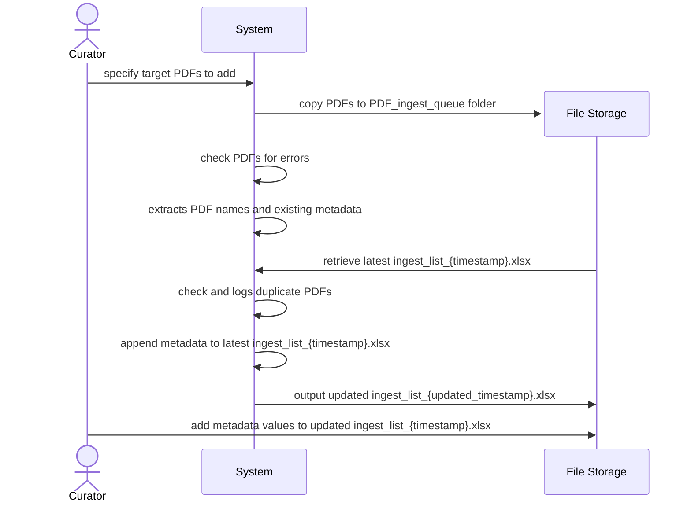

```mermaid
sequenceDiagram
    actor Curator
    participant System
    Curator->>System: specify target PDFs to add
    create participant File Storage 
    System->>File Storage: copy PDFs to PDF_ingest_queue folder
    System->>System: check PDFs for errors
    System->>System: extracts PDF names and existing metadata
    File Storage->>System: retrieve latest ingest_list_{timestamp}.xlsx
    System->>System: check and logs duplicate PDFs
    System->>System: append metadata to latest ingest_list_{timestamp}.xlsx
    System->>File Storage: output updated ingest_list_{updated_timestamp}.xlsx
    Curator->>File Storage: add metadata values to updated ingest_list_{timestamp}.xlsx
```
