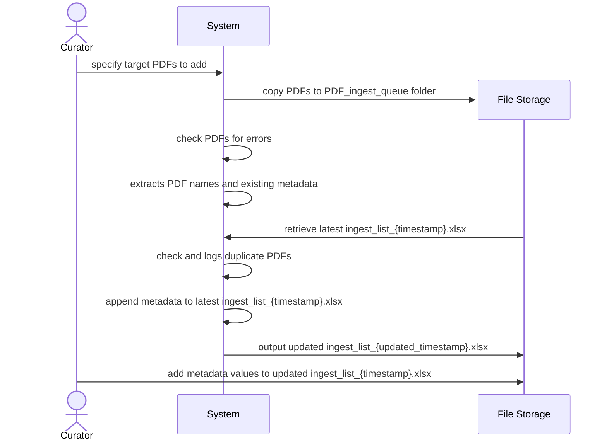
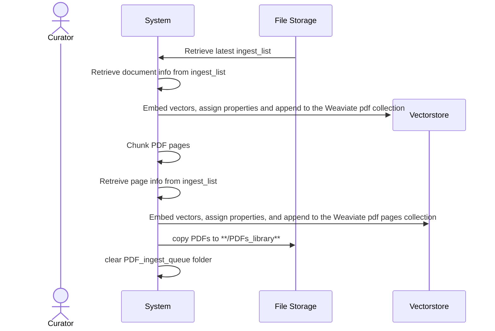

## ASK System Administration (Weaviate)
#### Adding PDFs to Library
##### 1. Prepare the document metadata

```mermaid
sequenceDiagram;
    actor Curator;
    participant System;

    Curator->>System: specify target PDFs to add;
    create participant File Storage;
    System->>File Storage: copy PDFs to PDF_ingest_queue folder;
    System->>System: check PDFs for errors;
    System->>System: extracts PDF names and existing metadata;
    File Storage->>System: retrieve latest ingest_list_{timestamp}.xlsx;
    System->>System: check and logs duplicate PDFs;
    System->>System: append metadata to latest ingest_list_{timestamp}.xlsx;
    System->>File Storage: output updated ingest_list_{updated_timestamp}.xlsx;
    Curator->>File Storage: add metadata values to updated ingest_list_{timestamp}.xlsx;
```

##### 2. Upsert the PDFs and metadata into the vectorstore

```mermaid
sequenceDiagram
    actor Curator
    participant System

    File Storage->>System: Retrieve latest ingest_list
    System->>System: Retrieve document info from ingest_list
    create participant Vectorstore
    System->>Vectorstore: Embed vectors, assign properties and append to the Weaviate pdf  collection
    System->>System: Chunk PDF pages
    System->>System: Retreive page info from ingest_list
    System->>Vectorstore: Embed vectors, assign properties, and append to the Weaviate pdf pages collection
    System->>File Storage: copy PDFs to **/PDFs_library**
    System->>System: clear PDF_ingest_queue folder
```

