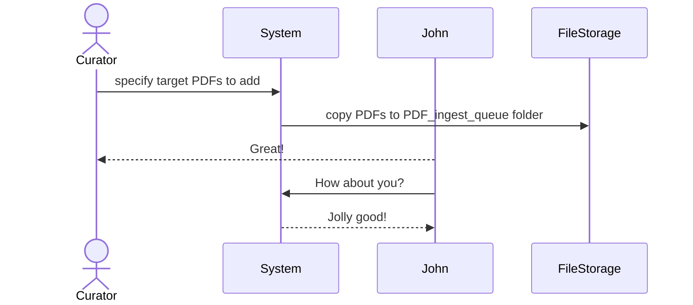

## ASK System Administration (Weaviate)
#### Adding PDFs to Library
##### 1. Prepare the document metadata

```mermaid
sequenceDiagram
    actor Curator
    participant System
    participant John
    participant FileStorage
    Curator->>System: specify target PDFs to add
    System->>FileStorage: copy PDFs to PDF_ingest_queue folder
    John-->>Curator: Great!
    John->>System: How about you?
    System-->>John: Jolly good!
```
