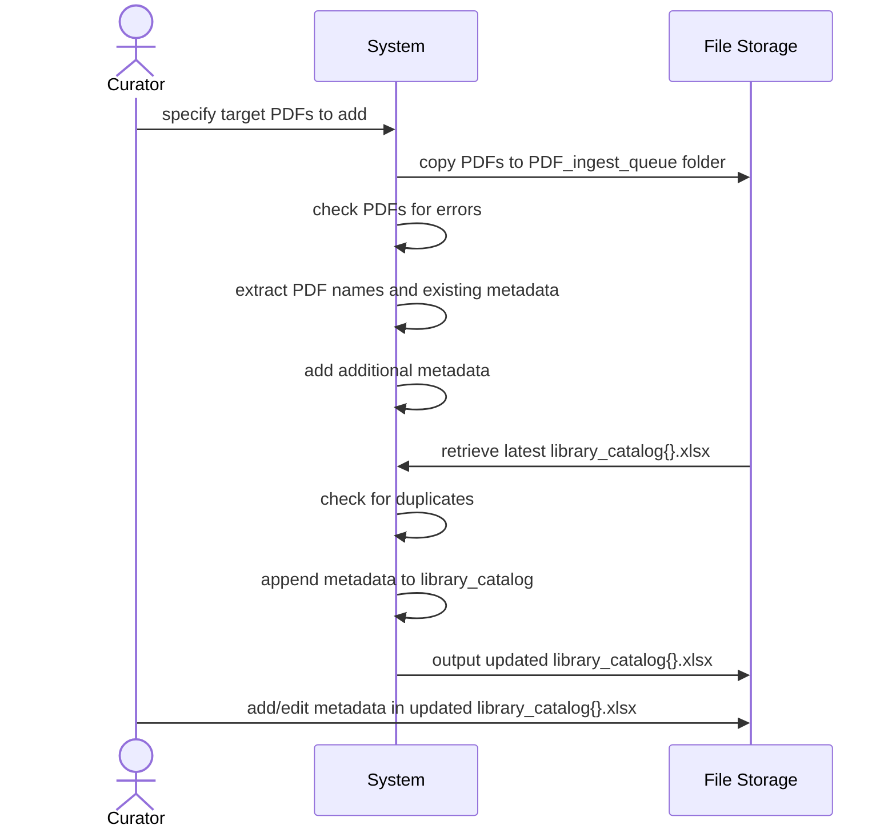
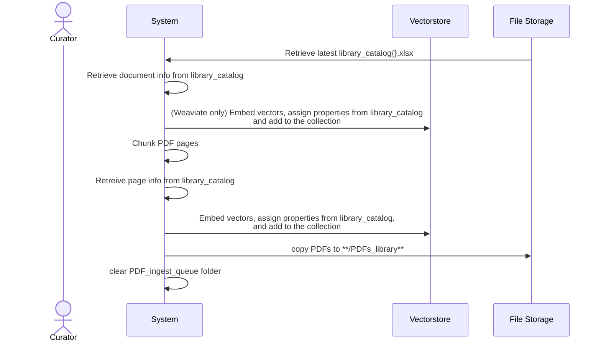

## ASK System Administration
#### Adding PDFs to Library
##### 1. Prepare the document metadata (prep_document_metadata.ipynb)

##### 2. Upsert the PDFs and metadata into the vectorstore (upsert_pdfs_and_payload.ipynb)

